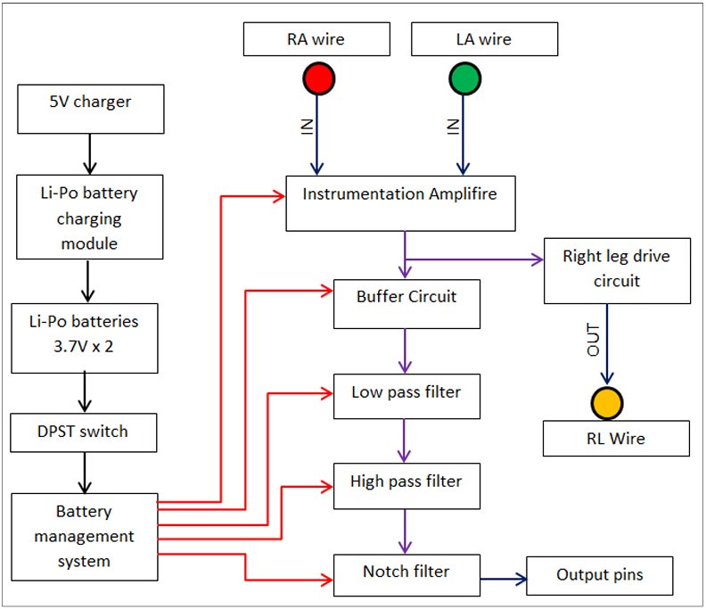
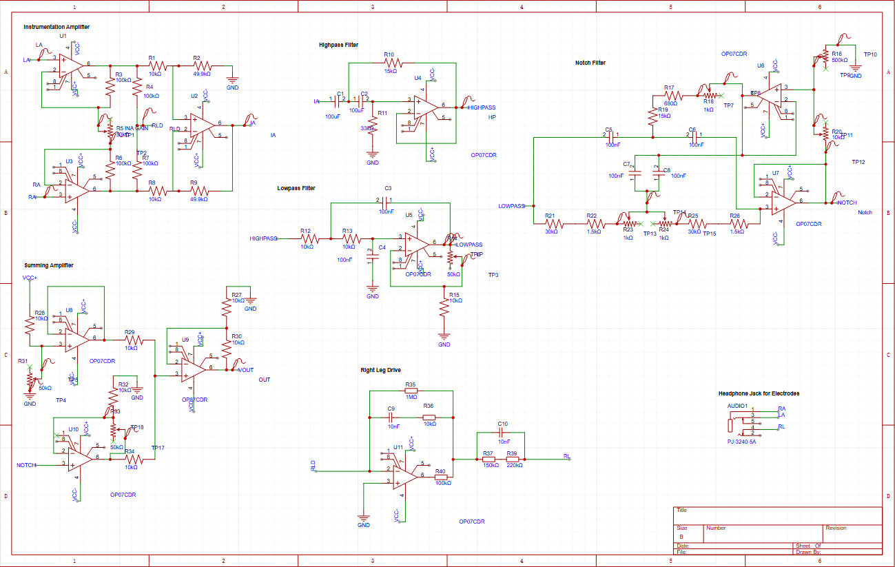
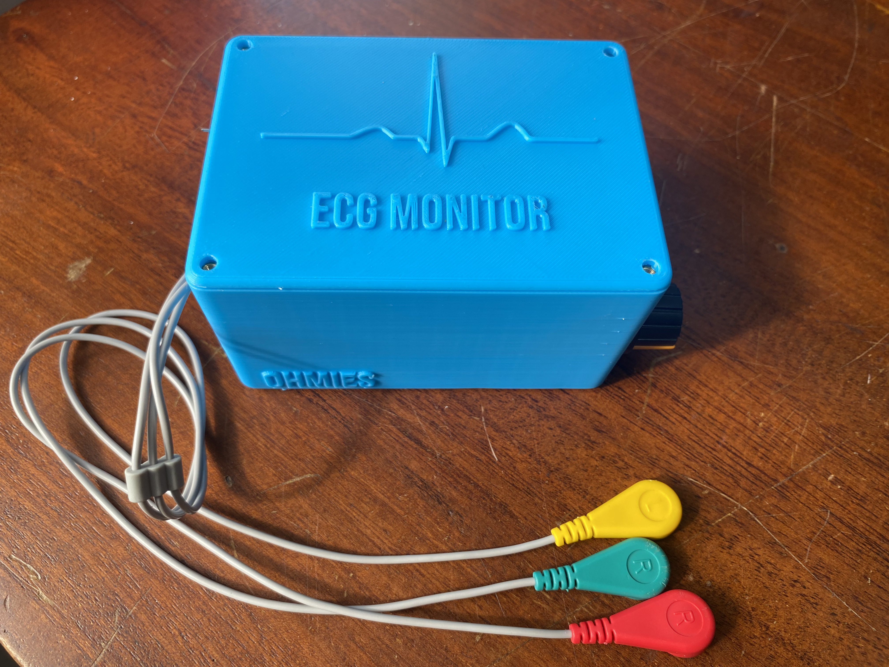
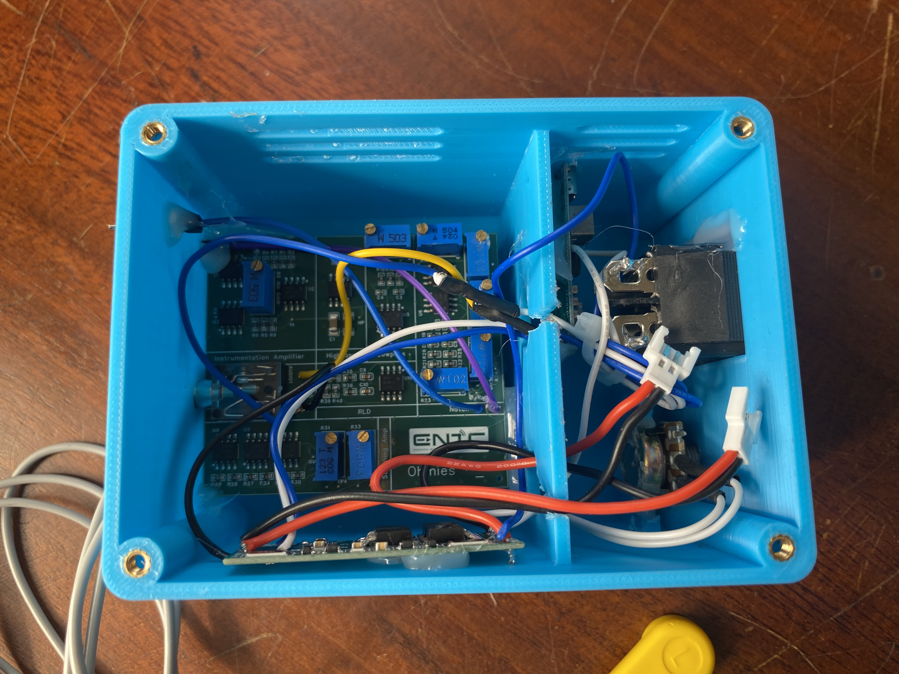
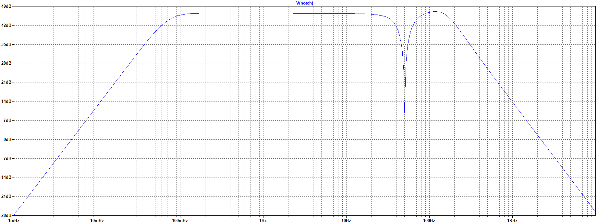
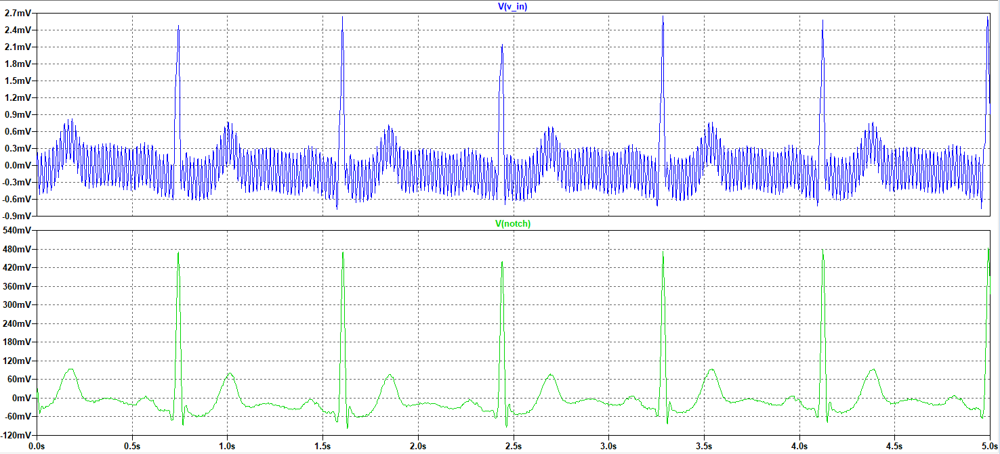

#  Heart ECG Monitor — Ohmies

A portable, battery-powered analog front-end for single-lead ECG signal acquisition, designed as part of the **EN2091 Laboratory Practice and Projects Module** at the University of Moratuwa, Faculty of Engineering, Department of Electronic and Telecommunication Engineering.

---

##  Team — Ohmies

| Name | Index |
|---|---|
| Keerawella K.P.C.P. | 230332B |
| Jathunwaththa J.C.R.N. | 230266B |
| Induwara M.L.A.S. | 230261F |
| Colombage D.M. | 230108U |

---

##  Repository Structure

```
Ohmies_ECG/
├── PCB_Files/           # EasyEDA Pro PCB design files
├── Schematic_Files/     # Circuit schematics
├── Enclosure_Files/     # SolidWorks & STL files for the 3D printed enclosure
├── Docs/                # Images, photos, and project documents
│   ├── block_diagram.png
│   ├── sch.png
│   ├── bode_plot.png
│   ├── transient_response.png
│   ├── enclosure_front.jpg
│   ├── enclosure_open.jpg
│   ├── Final_Report.pdf
│   ├── Presentation.pdf
│   ├── User_Manual.pdf
│   └── Datasheet.pdf
├── LICENSE
└── README.md
```

---

##  Overview

This project implements a complete analog signal conditioning chain to capture, amplify, and filter biopotential ECG signals from the human body. ECG signals are extremely low amplitude (microvolts to millivolts) and are typically corrupted by power-line interference, baseline wander, and muscle artifacts. The device addresses all of these challenges in hardware.

The system was designed with emphasis on **patient safety**, **signal integrity**, and **noise rejection**, and successfully acquired live ECG waveforms with clearly identifiable P, QRS, and T complexes.

---

##  Documents

| Document | Link |
|---|---|
| Final Report | [Final_Report.pdf](./Docs/Final_Report.pdf) |
| Presentation | [Presentation.pdf](./Docs/Presentation.pdf) |
| User Manual | [User_Manual.pdf](./Docs/User_Manual.pdf) |
| Datasheet | [Datasheet.pdf](./Docs/Datasheet.pdf) |

---

##  System Architecture



---

##  Circuit Stages



### Instrumentation Amplifier
- Extracts the differential signal between the Left Arm (LA) and Right Arm (RA) electrodes
- High input impedance, high CMRR
- Adjustable gain via external resistor R5:

$$V_{IA} = \frac{R_2}{R_1}\left(1 + \frac{2R_3}{R_5}\right)(V_{LA} - V_{RA})$$

### Right Leg Drive (RLD)
- Actively cancels common-mode interference by sensing, inverting, and feeding it back to the body via the RL electrode
- Significantly improves effective CMRR and prevents static charge buildup

### High-Pass Filter
- Topology: 2nd-order Sallen–Key HPF
- Cutoff frequency: **~0.072 Hz**
- Components: R10 = 15 kΩ, R11 = 33 kΩ, C1 = C2 = 100 µF
- Removes DC offsets, baseline wander, and slow motion artifacts

### Low-Pass Filter
- Topology: 2nd-order adjustable-gain Sallen–Key LPF
- Cutoff frequency: **~159.2 Hz**
- Components: R12 = R13 = 10 kΩ, C3 = C4 = 100 nF
- Removes electromyographic interference and high-frequency EM noise

### Notch Filter
- Topology: Active twin-T notch filter with multiple feedback
- Notch frequency: **~50.37 Hz**
- Components: R = 31.6 kΩ, C = 100 nF
- Suppresses 50 Hz power-line interference

### Power Circuit
- Dual ±3.7 V supply from two series-connected Li-Po batteries
- Battery-powered for electrical isolation from mains and reduced 50 Hz susceptibility
- Includes a BMS (Battery Management System) and USB-C charging via a Li-Po charging module
- Controlled by a DPST switch

---

##  PCB Design

- **Tool:** EasyEDA Pro
- **Stackup:** 4-layer — Signal-1 / Power / GND / Signal-2
- Solid ground plane with ground fills on all layers, stitched via vias
- Wide power traces to minimise inductance and heating
- Analog signal paths kept short and isolated from power regulation circuitry

---

##  Enclosure

- **CAD Tool:** SolidWorks
- **Material:** PLA (3D printed)
- **Dimensions:** 110 mm × 80 mm × 60 mm
- **Features:**
  - Power switch
  - 3.5 mm audio jack for electrode input
  - USB-C charging port
  - Header pins for oscilloscope output
  - Ventilation openings
  - Internal compartment for batteries and BMS

>  SolidWorks and STL files are available in the [`Enclosure_Files/`](./Enclosure_Files) folder.

---

## 🔩 Final Prototype

| Front View | Internal Assembly |
|---|---|
|  |  |

---

##  Testing & Results

### Simulation (LTSpice)
- Bode plot analysis confirmed correct passband and stopband behaviour across all filter stages
- Transient analysis verified effective 50 Hz attenuation while preserving ECG morphology

**Bode Plot — Combined filter frequency response:**



**Transient Response — Input (blue) vs. notch filter output (green):**



### Hardware Testing
1. **Breadboard prototype** — iterative tuning of gain and cutoff frequencies, cross-verified in LTSpice
2. **PCB prototype** — continuity checks, functional tests; results consistent with simulation
3. **Live subject test** — clearly identifiable P, QRS, and T complexes acquired via surface electrodes

---

##  Bill of Materials (Key Components)

| Component | Quantity |
|---|---|
| OP07 Op-Amp | 11 |
| 10 kΩ Resistor | 12 |
| 100 nF Capacitor | 6 |
| 100 µF Capacitor | 2 |
| 49.9 kΩ Resistor | 2 |
| 100 kΩ Resistor | 5 |
| 50 kΩ Trimmer | 4 |
| 1 kΩ Trimmer | 3 |
| Li-Po Battery (3.7 V) | 2 |
| Battery Management System | 1 |
| ECG wire set (3.5 mm jack) | 1 |

> See the full BOM in the [Final Report](./Docs/Final_Report.pdf).

---

##  Future Improvements

- Onboard OLED/TFT display for real-time waveform visualisation
- ESP32 integration for Wi-Fi/Bluetooth wireless monitoring
- Cloud-based ECG storage and remote access
- Real-time R-peak detection and BPM calculation
- Digital FIR/IIR filters to supplement or replace analog stages
- Adaptive filtering for motion artifact suppression
- SD card data logging and playback
- Multi-lead ECG expansion
- Low-power optimisation for extended battery life
- Enhanced isolation and medical device safety compliance

---

##  References

1. Webster, J. G. (2009). *Medical Instrumentation: Application and Design.* John Wiley & Sons.
2. Winter, B. B., & Webster, J. G. (1983). Driven-right-leg circuit design. *IEEE Transactions on Biomedical Engineering*, (1), 62–66.
3. Texas Instruments. (2019). *A Basic Guide to Thermocouple Measurements* (Application Note).

---

*University of Moratuwa — Faculty of Engineering — Department of Electronic and Telecommunication Engineering*
